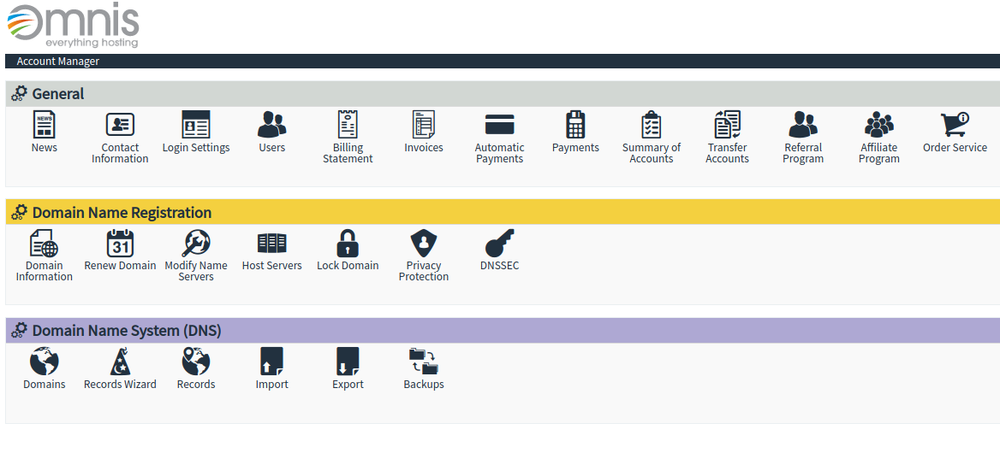
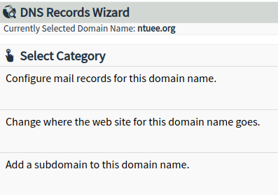
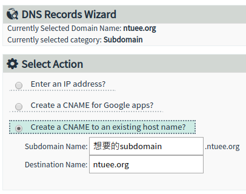

# 關於憑證

所有設定檔都放在這裡

```bash
cd /etc/letsencrypt # Let's Encrypt
vim cli.ini         # 設定檔本人
```

## 實際去發憑證要用`certbot`(`/usr/bin/certbot`)

```bash
cd /home/ntuee/production
docker-compose stop nginx                    # nginx 會佔用 80，會讓certbot失敗
sudo certbot certonly --standalone --dry-run # 先用--dry-run試試看看可不可以成功(否則失敗的話有冷卻時間)
certbot certonly --standalone                # 實際去發憑證
```

## Renew(還沒測試過)

還沒到快過期的時候執行 renew 不會有效果，但是不會報錯，會看到下面這個訊息

```
- - - - - - - - - - - - - - - - - - - - - - - - - - - - - - - - - - - - - - - -
The following certs are not due for renewal yet:
  [憑證路徑] expires on [時間] (skipped)
No renewals were attempted.
- - - - - - - - - - - - - - - - - - - - - - - - - - - - - - - - - - - - - - - -
```

```bash
cd /home/ntuee/production
docker-compose stop nginx                    # nginx 會佔用 80，會讓certbot失敗
sudo certbot renew --dry-run # 先用--dry-run試試看看可不可以成功(否則失敗的話有冷卻時間)
certbot renew
```

## 如何新增 Subdomain

目標是別人 nslookup xxx.ntuee.org 的時候會找到 ntuee.org，再讓 nginx 導到 site-enabled 的 server 下

1. 加入 CNAME

   1. 到[Omnis](https://www.omnis.com/manage/login)登入，帳號是`ntuee`
   2. 選擇`Records Wizard`

      

   3. 選擇`Add a subdomain to this domain name`

      

   4. 選擇`Create a CNAME to an existing host name`，把 subdomain 指向`ntuee.org`

      

2. 重發憑證

```bash
vim /etc/letsencrypt/cli.ini # 在domains 加入要新增的 domain
# 接著用上面certonly的流程跑
```

## (Experimental) 自動 renew

使用`systemd`的 Unit 來達成自動 renew。

設定檔在`/etc/systemd/system`，`certbot.service`和`certbot.timer`

1. certbot.service

   - 執行 certbot renew，開始和結束會自動關閉/啟動 nginx
     - 不確定有沒有錯，如果不太有效的話，可以使用 certbot 的 pre-hook 和 post-hook

2. certbot.timer

   - xxx.service 會自動對應到 xxx.timer
   - `sudo systemctl enable certbot.timer`之後，每次開機都會常駐跑 timer
   - `sudo systemctl list-timers`可以看到所有開啟的 timer 以及其 service
     - `--all`可以看到包含`inactive`的 timer
   - 0/12:00:00 代表在 00:00:00 以及 12:00:00 觸發
   - RandomizedDelaySec 代表觸發之後要 delay 多久才開始執行 service
   - Persistent 代表被打斷之後還會嘗試重新執行
   - timers.target 會把所有開機之後執行的 timer 打開

- 使用方法
  - `sudo systemctl enable certbot.timer` / `sudo systemctl disable certbot.timer`
    - 一般來說不用去動他，保持`enable`就好了
  - `sudo systemctl stop certbot.timer` / `sudo systemctl start certbot.timer` / `sudo systemctl restart certbot.timer`
    - start / stop / restart 某個 Unit
    - 可以手動 start `certbot.service`，不過沒什麼意義
  - `sudo systemctl status certbot.timer` / `sudo systemctl status certbot.service`
    - 看 Unit 目前的狀態以及執行紀錄
